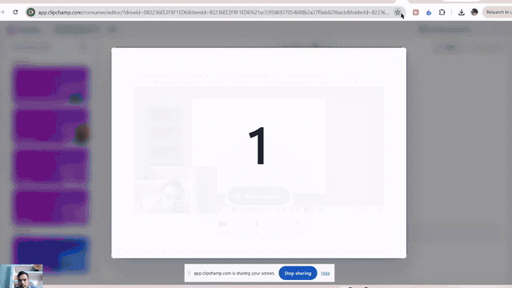

# AI Knowledge Engine

NestJS API with switchable **Ollama**, **Google Gemini**, or **OpenAI** providers.

- **Phase 1:** chat, structured output, tool/function calling
- **Phase 2 (Week 3):** pgvector semantic search — store documents (chunk + embed) and search by meaning
- **Phase 3:** RAG `/query` (retrieve + answer grounded in sources) and file upload (`.txt`/`.pdf`) with duplicate detection

Later phases add async ingestion, Redis caching, streaming, and multi-tenant auth.

See [docs/BRD.md](./docs/BRD.md) for the full phased requirements.

## Demo



**[Full quality (MP4)](./demo/aiknowledgeenginedemo1.mp4)** · **[Captions (SRT)](./demo/aiknowledgeenginedemo1.srt)**

Open the built-in chat UI at **http://localhost:3000/** (upload a PDF/TXT, ask a question, see answer + sources).

Swagger: **http://localhost:3000/docs** · Full walkthrough: [demo/README.md](./demo/README.md).

## Prerequisites

- Node.js 20+ (this project was built with **v22.22.0**)
- npm **10.9.7** (or compatible)
- **Ollama** (default, local, free) — [docs/ollama-setup.md](./docs/ollama-setup.md)
- **Docker** (for Postgres + pgvector, Phase 2+)

## LLM providers

| Provider | Setup doc | When to use |
|----------|-----------|-------------|
| **Ollama** (default) | [ollama-setup.md](./docs/ollama-setup.md) | Free local dev, full RAG path |
| **Gemini** | [gemini-setup.md](./docs/gemini-setup.md) | Free cloud, no GPU |
| **OpenAI** | `.env.example` | Paid, interview polish |

**Comparison table:** [docs/llm-provider-comparison.md](./docs/llm-provider-comparison.md)

## Tooling & versions

| Tool / package | Version |
|----------------|---------|
| Node.js | 22.22.0 |
| npm | 10.9.7 |
| NestJS CLI | 11.0.21 |
| NestJS core | 11.1.24 |
| TypeScript | 5.9.3 |
| `@google/generative-ai` | 0.24.1 |
| OpenAI SDK (`openai`) | 6.39.1 |
| `@nestjs/swagger` | 11.4.4 |

## Setup (Ollama — default)

**Full guide:** [docs/ollama-setup.md](./docs/ollama-setup.md)

```bash
npm install
cp .env.example .env   # Windows: copy .env.example .env
```

Install Ollama from https://ollama.com/download, then:

```bash
ollama pull llama3.2
ollama pull nomic-embed-text
```

Start the database (Postgres + pgvector), then the app:

```bash
docker compose up -d      # Postgres + pgvector on host port 5433
npm run start:dev
```

> Note: the container maps host port **5433** (5432 is often taken by a local Postgres).
> Change `DB_PORT` in `.env` + `docker-compose.yml` if needed.

`.env` (default):

```env
LLM_PROVIDER=ollama
OLLAMA_CHAT_MODEL=llama3.2
```

### Switch provider

```env
LLM_PROVIDER=gemini   # + GEMINI_API_KEY
LLM_PROVIDER=openai   # + OPENAI_API_KEY
```

Restart the server after changing `.env`.

## Swagger (API docs)

| Link | Description |
|------|-------------|
| [http://localhost:3000/docs](http://localhost:3000/docs) | **Swagger UI** |
| [http://localhost:3000/docs-json](http://localhost:3000/docs-json) | **OpenAPI JSON** |

## API

### Health check

```bash
curl http://localhost:3000/health
```

### Chat

```bash
curl -X POST http://localhost:3000/chat \
  -H "Content-Type: application/json" \
  -d "{\"message\":\"What is RAG in one sentence?\"}"
```

**Response:**

```json
{
  "reply": "...",
  "model": "llama3.2",
  "provider": "ollama",
  "usage": {
    "promptTokens": 25,
    "completionTokens": 40,
    "totalTokens": 65
  }
}
```

### Structured document metadata (Week 2)

Extract validated metadata from raw document text — useful before chunking/embedding in later RAG phases.

```bash
curl -X POST http://localhost:3000/chat/structured \
  -H "Content-Type: application/json" \
  -d "{\"text\":\"Return Policy\\n\\nItems may be returned within 30 days of purchase with receipt.\"}"
```

**Response:**

```json
{
  "metadata": {
    "title": "Return Policy",
    "language": "en",
    "documentType": "policy",
    "tags": ["returns", "refund", "receipt"],
    "indexable": true,
    "confidence": 0.92
  },
  "model": "llama3.2",
  "provider": "ollama",
  "usage": {
    "promptTokens": 120,
    "completionTokens": 80,
    "totalTokens": 200
  }
}
```

### Store a document (Week 3)

Chunks the text, embeds each chunk (`nomic-embed-text`), and stores vectors in pgvector.

```bash
curl -X POST http://localhost:3000/documents \
  -H "Content-Type: application/json" \
  -d "{\"text\":\"Return Policy\\n\\nItems may be returned within 30 days of purchase with a valid receipt.\"}"
```

**Response:** `{ "id": "...", "title": "Return Policy", "sourceType": "text", "chunkCount": 1, "duplicate": false }`

Re-sending identical content is a no-op — the response comes back with `"duplicate": true` and nothing is re-embedded.

### Upload a file (.txt or .pdf)

Extracts the text, then ingests it exactly like `POST /documents` (max 10 MB).

```bash
curl -X POST http://localhost:3000/documents/upload \
  -F "file=@./policy.pdf" \
  -F "title=Return Policy"
```

**Response:** `{ "id": "...", "title": "Return Policy", "sourceType": "pdf", "chunkCount": 12, "duplicate": false }`

### Semantic search (Week 3)

Embeds the query and returns the top-k most similar chunks by cosine similarity.

```bash
curl -X POST http://localhost:3000/search \
  -H "Content-Type: application/json" \
  -d "{\"query\":\"how many days to return an item?\",\"topK\":3}"
```

**Response:**

```json
{
  "query": "how many days to return an item?",
  "results": [
    {
      "chunkId": "...",
      "documentId": "...",
      "title": "Return Policy",
      "chunkIndex": 0,
      "content": "Return Policy Items may be returned within 30 days...",
      "score": 0.78
    }
  ]
}
```

### Ask a question (RAG)

Retrieves the top-k chunks and answers **using only those chunks**, returning the sources.

```bash
curl -X POST http://localhost:3000/query \
  -H "Content-Type: application/json" \
  -d "{\"query\":\"How long is the guarantee on Acme products?\"}"
```

**Response:**

```json
{
  "answer": "All Acme Electronics products come with a 2-year limited warranty covering manufacturing defects.",
  "grounded": true,
  "sources": [
    { "chunkId": "...", "title": "Acme Electronics Warranty", "score": 0.72, "content": "..." }
  ],
  "model": "llama3.2",
  "provider": "ollama",
  "usage": { "promptTokens": 485, "completionTokens": 29, "totalTokens": 514 }
}
```

If nothing relevant is stored, it replies `"I don't know based on the available documents."` instead of guessing.

## Project structure

```text
src/
  chat/       POST /chat, /chat/structured, /chat/tools
  documents/  POST /documents, /documents/upload, /search, DELETE /documents
  query/      POST /query (RAG: retrieve + generate)
  health/     GET /health
  llm/        Ollama + Gemini + OpenAI providers, tools/, embeddings
db/
  init.sql    pgvector extension + schema + HNSW index
demo/
  README.md               step-by-step demo runbook
  demo.gif                inline README preview (~2.7 MB)
  aiknowledgeenginedemo1.mp4   full-quality walkthrough
  aiknowledgeenginedemo1.srt   captions for the demo video
  ai-knowledge-engine-handbook.pdf   sample doc ("ask the AI about itself")
  generate-handbook.js    regenerates the PDF
docker-compose.yml   Postgres 16 + pgvector
docs/
  BRD.md
  ollama-setup.md
  gemini-setup.md
  llm-provider-comparison.md
```

## Live walkthrough

See [demo/README.md](./demo/README.md) for a full 5-minute walkthrough: load the bundled
handbook, ask the engine questions about itself (with cited sources), watch it refuse a
question it has no data for, then upload another document and watch it answer instantly.
Use `DELETE /documents` to reset between runs. Preview: [demo.gif](./demo/demo.gif) ·
full quality: [aiknowledgeenginedemo1.mp4](./demo/aiknowledgeenginedemo1.mp4)
([captions](./demo/aiknowledgeenginedemo1.srt)).

## Related

- [Learning roadmap](https://github.com/MukeshSinghBisht/ai-backend-engineer-roadmap)
